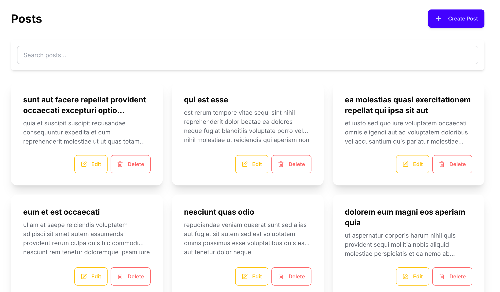

# CRUD Application with Next.js, TailwindCSS, and DaisyUI

A full-featured CRUD application that demonstrates a modern web application using Next.js, TailwindCSS, and DaisyUI. The application interacts with the JSONPlaceholder API to perform CRUD operations on posts.

## Features

- **Create**: Add new posts with form validation
- **Read**: View a list of posts in a responsive grid layout
- **Update**: Edit existing posts with pre-filled forms
- **Delete**: Remove posts with confirmation
- **Responsive Design**: Works on mobile, tablet, and desktop
- **Parallax Scrolling**: Beautiful landing page with parallax effect
- **Toast Notifications**: User-friendly alerts for all CRUD operations

## Technologies Used

- **Next.js**: React framework for server-side rendering and static site generation
- **TailwindCSS**: Utility-first CSS framework
- **DaisyUI**: Component library for TailwindCSS
- **React Query**: Data fetching and state management
- **React Hook Form**: Form handling with validation
- **Zod**: Schema validation
- **JSONPlaceholder API**: Fake REST API for testing and prototyping


[](https://crud-app-next-q4x20o4x8-sushanthksrs-projects.vercel.app/)

### Installation for your system

1. Clone the repository:
   ```bash
   git clone https://github.com/yourusername/crud-nextjs-tailwind-daisyui.git
   cd crud-nextjs-tailwind-daisyui
   ```

2. Install dependencies:
   ```bash
   npm install
   ```

3. Run the development server:
   ```bash
   npm run dev
   ```

4. Open [http://localhost:3000](http://localhost:3000) in your browser to see the application.


## Deployment

This application has been deployed to Vercel : https://crud-app-next-js-rho.vercel.app/

## Features:

### Managing State Across Components

Used React Query for global state management, which provides caching, refetching, and easy invalidation of data.

### Responsive Design

Utilized TailwindCSS's responsive utilities and DaisyUI's responsive components to ensure the application works well on all device sizes.
